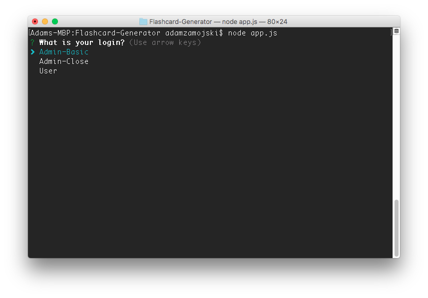
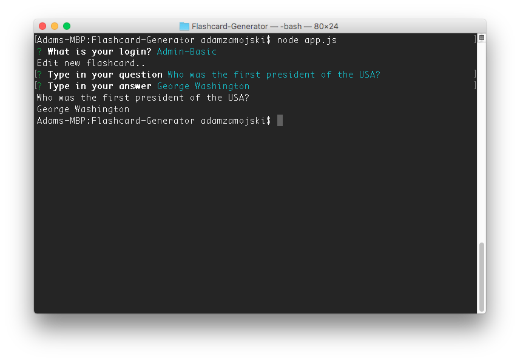
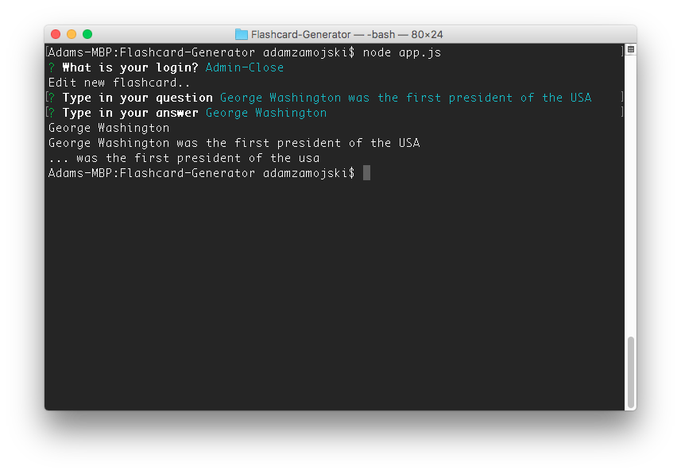
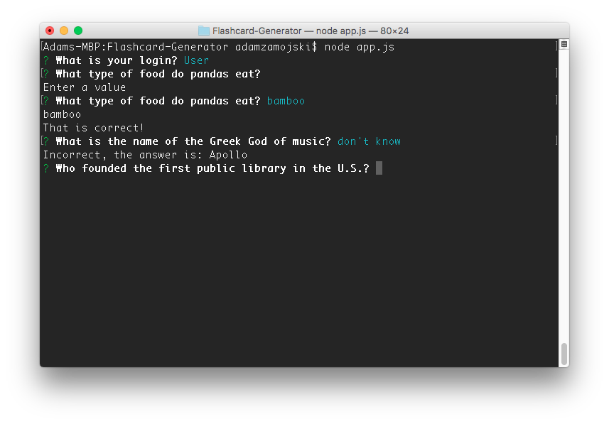

# Flashcard-Generator

## Description
This Flashcard app will allow user to make questions and answers
that simulate a typical flashcard. The admin will allow you to
make two types of cards: one with a question and the answer (Basic)
while the other will have a statement with the whole answer but
delete the portion with the answer in it while the user must 'fill'
in the blank (closeCard)

## How it works

The user first gets prompted to pick `Admin-Basic, Admin-Close
or User` Example: 

### Admin-Basic

When you choose Admin-Basic you will be creating a flashcard with a 
front and a back. First type in a question Example `Who was the first
president of the USA?` then type in an answer: `George Washington` Example:

### Admin-Close
Admin-Close is another flashcard that that will create a statement, 
the answer, and a 'close' part of the statement. Example: For the full: 
`George Washington was the first president of the USA`, the answer is:
`George Washington` and the close part will remove George Washington
and replace the answer with three dots: `... was the first president
of the USA`. Example: 

### User
If `User` is selected, the individual will be asked questions based on
the array of created questions until all the array or questions run out.
If a value for the answer is not enter, the user will not be able to proceed,
also whereas if you get an answer correct or wrong, you will be notified
accordingly. Example: 
